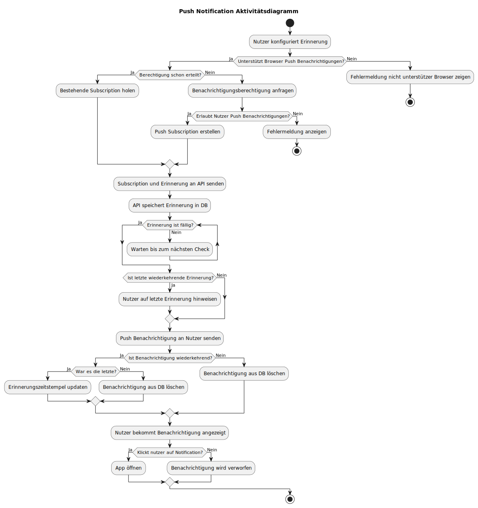

# Architektur Push Notifications des Füetterigszitplans

Diese Dokumentation beschreibt die wichtigsten Abläufe und Architekturentscheidungen des Füetterigszitplans.

## Push-Benachrichtigungen

Der Suurteigrechner unterstützt Push-Benachrichtigungen, um Nutzer an die Fütterung ihres Sauerteigs zu erinnern. Die Implementierung basiert auf der [Web Push API](https://developer.mozilla.org/en-US/docs/Web/API/Push_API).

### Dispatcher

Der Notification-Dispatcher läuft als Teil des Node.js-Prozesses und prüft jede Minute auf fällige Erinnerungen:

1. **Start**: Wird beim ersten Datenbankzugriff initialisiert
2. **Timing**: Selbst-korrigierender Timer, der sich an Minutengrenzen ausrichtet
3. **Singleton**: Läuft nur einmal pro Prozess (über `global.__dispatcherStarted`)

### Ablaufdiagramm

Das folgende Aktivitätsdiagramm zeigt den vollständigen Ablauf von der Konfiguration einer Erinnerung bis zur Anzeige der Benachrichtigung:

### Wiederkehrende Erinnerungen

Erinnerungen können einmalig oder wiederkehrend sein:

- **Einmalig**: Wird nach dem Versand gelöscht
- **Wiederkehrend**: `scheduled_time` wird um `recurrence_interval_hours` erhöht, bis `end_date` erreicht ist
- **Letzte Erinnerung**: Bei der letzten wiederkehrenden Benachrichtigung wird der Nutzer darauf hingewiesen

## Diagramme generieren

Siehe [diagrams/README.md](diagrams/README.md) für Anleitungen zur Generierung der PlantUML-Diagramme.
